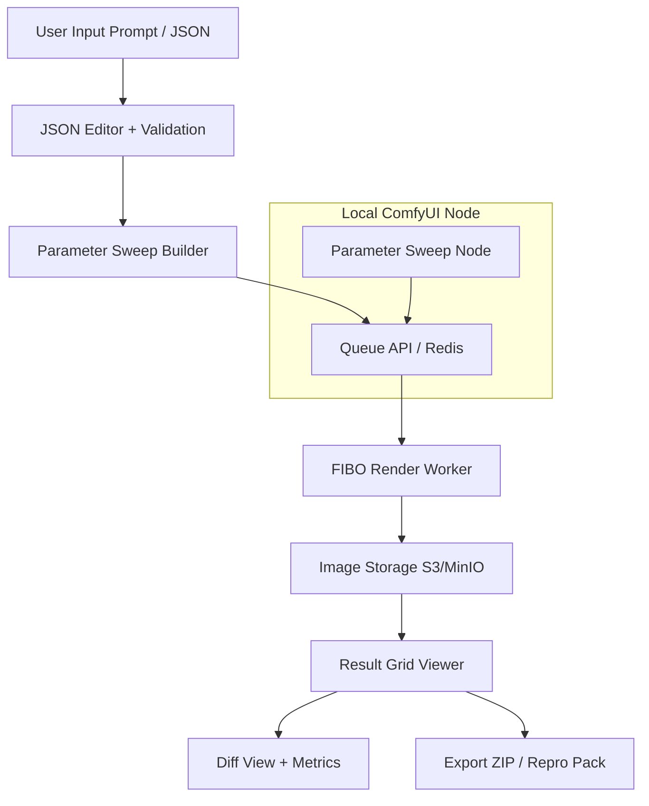

# 🧩 **FIBO ControlNet Visualizer**

**Category:** *Best Controllability / Professional Tool*

**By:** Mikel Ltd – Built with FIBO JSON-native architecture

---

## 1. Product Overview

### 1.1. Elevator Pitch

**“FIBO ControlNet Visualizer”** is a professional web and ComfyUI tool that demonstrates the *true controllability* of AI visual generation.

It lets users manipulate FIBO’s structured JSON parameters — such as camera angle, FOV, lighting, or color palette — and instantly visualize how each parameter affects output, all while maintaining deterministic control (same seed, same output).

Think of it as **“Stable Diffusion’s ControlNet meets Lightroom — but for structured AI JSON.”**

---

### 1.2. Core Problem

Most AI image tools rely on vague text prompts. Professionals lack **predictable control** — small wording changes cause huge shifts in result.

FIBO solves this through *JSON-native generation* — but editing JSON manually is tedious and abstract.

We solve this by creating a **visual, interactive interface** that:

- Lets you *see* how each FIBO parameter affects an image.
- Validates and diffs JSON changes live.
- Exports reproducible workflows for production.

---

### 1.3. Target Users

| Role | Use Case |
| --- | --- |
| 🎬 Art Directors | Explore controllable lighting and camera settings for a campaign |
| 🎨 Designers | Compare tone, palette, or mood changes consistently |
| 🧠 ML Researchers | Quantify “disentanglement” effects in FIBO |
| 👩‍💻 Developers | Integrate parameter sweep logic in pipelines or ComfyUI nodes |

---

## 2. Goals & Success Metrics

| Goal | Success Metric |
| --- | --- |
| Demonstrate controllability | Users can vary FOV or lighting and get consistent, predictable results |
| Show deterministic rendering | Same JSON + seed = identical output |
| Simplify JSON-native editing | Schema validation, autocomplete, diff views |
| Support structured sweeps | Generate grid of outputs varying 1–2 parameters |
| Enable reproducible research | Export JSON, images, and metadata bundles |

---

## 3. Key Features

| Feature | Description | Value |
| --- | --- | --- |
| 🎛️ **Parameter Sweep Grid** | Select one or two parameters (X/Y axes) and auto-generate a matrix of images with varying values | Visualizes controllability at a glance |
| 🧠 **JSON-Aware Editor** | Schema validation, syntax highlighting, and autocomplete for FIBO parameters | Makes structured generation usable |
| 🔍 **Side-by-Side Comparison** | Baseline vs. variant with JSON diff and optional change metrics (SSIM/LPIPS) | Proves disentangled control |
| ⚙️ **Deterministic Cache System** | Same JSON + seed = same result; cached to save GPU time | Ensures repeatability |
| 🌈 **HDR / 16-bit Mode** | Option to export higher bit-depth for professional workflows | Real production-grade fidelity |
| 🧩 **ComfyUI Integration (Bonus)** | Custom node for parameter sweeps | Usable in VFX pipelines (Nuke, ComfyUI) |

---

## 4. User Flow

```
[Landing Page]
  ↓
[Step 1] Paste or load base JSON / natural prompt
  ↓ (optional) Prompt → JSON via FIBO LLM translator
[Step 2] Select parameters to sweep (X/Y)
  ↓
[Step 3] Define value ranges (e.g., FOV 20→60; lighting temp 3000→6500)
  ↓
[Step 4] Render Grid → Progressive previews appear
  ↓
[Step 5] Hover to see JSON delta → click for A/B comparison
  ↓
[Step 6] Export results (ZIP: images + CSV + JSON + sweep spec)

```

**Bonus:** Re-run with same JSON → instant results (from cache).

---

## 5. Example Use Case (Judging Demo)

**Scenario:**

An ad agency wants to test how FOV and lighting affect a product shot.

- Base scene JSON: `ceramic shampoo bottle on a wooden table`
- Sweep X = `camera.fov` → [25, 35, 45, 55, 65]
- Sweep Y = `lights.key.temperature` → [3000K, 4000K, 5000K, 6000K, 6500K]
- Output: 25 images, grid layout, identical framing, only lighting changes.

Each cell shows:

```
Δ camera.fov: 35 → 55
Δ lights.key.temperature: 5000 → 6500

```

Proves FIBO’s disentanglement visually.

---

## 6. System Architecture (ASCII)

```
                      ┌──────────────────────────┐
                      │        Web UI (Next.js)  │
                      │  - JSON Editor           │
                      │  - Sweep Builder         │
                      │  - Grid Viewer           │
                      └──────────┬───────────────┘
                                 │
                        API (Next.js Routes)
                                 │
      ┌──────────────────────────┴───────────────────────────┐
      │                                                      │
┌────────────┐                                    ┌────────────────┐
│ Redis Queue│◄──── enqueue jobs ───────┐         │  Render Worker │
│ (BullMQ)   │                          │         │ (Node/Python)  │
└────┬───────┘                          │         │ - Calls FIBO API│
     │                                  │         │ - Cache / Store │
     │                                  ▼         └───────┬────────┘
     │                             ┌──────────────────────┘
     │                             ▼
     │                      ┌───────────────┐
     │                      │ S3 / MinIO    │  ← stores PNG/TIFF
     │                      └───────────────┘
     │                             │
     ▼                             ▼
┌──────────────┐           ┌────────────────────┐
│ Postgres/SQLite│◄───────►│ Metadata & Metrics │
└───────────────┘           └────────────────────┘

```

**Optional:** ComfyUI node connects to the same API for batch parameter sweeps.

---

## 7. Technical Components

| Layer | Tech Stack | Notes |
| --- | --- | --- |
| Frontend | Next.js (App Router), Tailwind, shadcn/ui, Monaco Editor | Clean UI, code highlighting for JSON |
| Backend | Node.js API (TypeScript), BullMQ, Redis | Task queue and job control |
| Rendering | Python or Node Worker calling FIBO API | Supports both local and hosted FIBO |
| Storage | MinIO/S3 for images, SQLite/Postgres for metadata | Lightweight, portable |
| ComfyUI Plugin | Custom Python Node | Allows integration into visual workflows |

---

## 8. Data Model (simplified)

### `runs`

| Column | Type | Description |
| --- | --- | --- |
| id | UUID | Run ID |
| base_json | JSON | Base generation configuration |
| seed | INT | Random seed |
| model_version | TEXT | FIBO version used |
| created_at | TIMESTAMP | Audit trail |

### `variants`

| Column | Type | Description |
| --- | --- | --- |
| id | UUID | Variant ID |
| run_id | UUID | Reference to `runs` |
| delta | JSON | Changed parameters |
| json_full | JSON | Full JSON used |
| json_hash | TEXT | Deterministic hash key |
| status | TEXT | queued / done / failed |
| image_url | TEXT | Stored render URL |

---

## 9. Core Algorithms

### 9.1. Parameter Sweep Expansion

Expands a base JSON across given parameter ranges.

```tsx
function expandSweep(base, sweep) {
  const results = [];
  for (const x of sweep.x.values) {
    for (const y of (sweep.y?.values || [null])) {
      const j = structuredClone(base);
      setAtPath(j, sweep.x.path, x);
      if (y) setAtPath(j, sweep.y.path, y);
      results.push(j);
    }
  }
  return results;
}

```

### 9.2. Deterministic Hash

Ensures identical inputs yield identical results.

```tsx
function hashJSON(obj) {
  const str = JSON.stringify(obj);
  return crypto.createHash("sha256").update(str).digest("hex").slice(0, 16);
}

```

---

## 10. FIBO Integration

- FIBO runs locally or via API (docs.bria.ai).
- Worker posts JSON payloads:
    
    ```
    POST /v1/generate
    {
      "model": "fibo-v1",
      "json": { ...controlled parameters... },
      "seed": 1337
    }
    
    ```
    
- Output image returned as base64 or URL.
- Optional 16-bit export (`bit_depth: 16`).

---

## 11. Demo Presets

| Preset | X Parameter | Y Parameter | Description |
| --- | --- | --- | --- |
| 🎥 Cinematic | `camera.fov [20→80 step15]` | `camera.angle ["low","eye","high"]` | Shot angle comparison |
| 💡 Studio | `lights.key.intensity [0.4→1.0 step0.2]` | `lights.key.temperature [3000→6500 step500]` | Light variation |
| 🎨 Color | `color_palette.name ["neutral","warm","cool"]` | `composition.balance [0.2→0.8 step0.2]` | Mood control |

---

## 12. Export / Reproducibility

- Export ZIP includes:
    - `/images/*.png`
    - `/metadata/sweep.json`
    - `/metadata/base.json`
    - `/metadata/variants.csv`
- JSON hash and seed guarantee identical re-render.
- Example:
    
    ```
    hash: 4f2a91c9f0b1e2d3
    model: fibo-v1
    seed: 1337
    
    ```
    

---

## 13. Future Enhancements

- 🔄 Multi-seed stability analysis (variance heatmap)
- 🧮 Quantitative “control quality” metrics
- 🧑‍🎨 FIBO-to-3D-preview pre-visualizer
- 🎬 Integration with Nuke / After Effects as plugin
- 🧰 FIBO-SDK integration for enterprise workflows

---

## 14. Evaluation Fit (Judging Criteria)

| Criterion | How It’s Addressed |
| --- | --- |
| **Usage of FIBO** | Full exploitation of JSON-native controls, HDR, camera, color, and FOV |
| **Potential Impact** | Usable by production studios, ad agencies, and researchers to measure AI controllability |
| **Innovation** | Introduces the first *parameter sweep grid + JSON diff visualizer* for deterministic image generation |
| **Scalability** | Modular API-based architecture; plug-and-play ComfyUI node |

---

## 15. Submission Summary

- ✅ Category: *Best Controllability / Professional Tool*
- 🎥 Demo: <3-min video showing live sweep + JSON diff
- 💻 Repo: Public GitHub (Next.js + Worker + ComfyUI node)
- 📦 Deliverables:
    - README with setup
    - Example outputs (grids, JSONs)
    - Exported sweep ZIP
    - Optional hosted demo (Cloud Run)

---

## 16. Visual Summary (Mermaid Diagram)



---

# 🏁 Summary

**FIBO ControlNet Visualizer** makes FIBO’s JSON-native generation tangible, visual, and measurable.

It bridges the gap between **AI controllability research** and **creative production workflows**, turning FIBO into a powerful professional visualization suite.

It’s not just “AI that draws”—it’s **AI you can direct.**